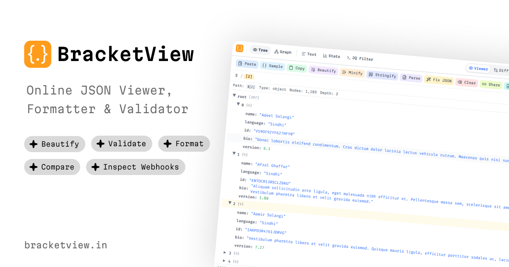

# BracketView

**AI-powered JSON workspace for modern developers** — inspect, format, validate, query, diff, and debug JSON faster in the browser.

[Website](https://bracketview.in) · [Open app](https://app.bracketview.in) · [Webhook Tester](https://app.bracketview.in/webhooks) · [Pricing](https://bracketview.in/pricing)

[](https://bracketview.in)
[](https://app.bracketview.in)
[](./LICENSE)
[](./package.json)
[](https://www.producthunt.com/products/bracketview)
[](https://www.saashub.com/bracketview)

<p align="center">
  <a href="https://bracketview.in">
    
  </a>
</p>

This repository is the **marketing site** for [BracketView](https://bracketview.in) (`bracketview.in`). The interactive JSON workspace runs at [app.bracketview.in](https://app.bracketview.in) (separate product app).

## Why BracketView

- **Debug JSON faster** — tree view, search, path breadcrumbs, and large-payload workflows
- **Format & validate** — beautify, minify, and catch syntax errors as you type
- **Query & transform** — JSONPath explorer and jq playground (WebAssembly)
- **Compare & schema** — JSON diff, schema validate/generate, TypeScript and other type exports
- **AI when you need it** — repair malformed JSON and assist with queries (fair-use free tier + Pro)
- **Webhook Tester** — disposable public capture URLs for API debugging
- **Privacy-first** — core viewing, formatting, and validation run in the browser

Freemium: core tools work with **no signup required**. Pro unlocks higher limits, Performance Mode, and more AI. See [pricing](https://bracketview.in/pricing).

> The marketing site may show third-party ads. The app workspace at `app.bracketview.in` stays **ad-free**.

## Live product links

| | URL |
| --- | --- |
| Marketing site | https://bracketview.in |
| JSON workspace | https://app.bracketview.in |
| Webhook Tester | https://app.bracketview.in/webhooks |
| Features | https://bracketview.in/features |
| Pricing | https://bracketview.in/pricing |
| Learn hub | https://bracketview.in/learn |
| Blog | https://bracketview.in/blog |

## Tool landing pages

- [JSON Viewer](https://bracketview.in/json-viewer)
- [JSON Formatter](https://bracketview.in/json-formatter)
- [JSON Validator](https://bracketview.in/json-validator)
- [JSON Diff](https://bracketview.in/json-diff)
- [JSONPath Query](https://bracketview.in/jsonpath-query)
- [JQ Playground](https://bracketview.in/jq-playground)
- [JSON Schema Validator](https://bracketview.in/json-schema-validator)
- [JSON Type Generator](https://bracketview.in/json-type-generator)
- [AI JSON Fixer](https://bracketview.in/ai-json-fixer)
- [Webhook Tester](https://bracketview.in/webhook-tester)

## Learn hub (AEO / GEO)

Answer-first guides: [What is JSON?](https://bracketview.in/learn/what-is-json) · [JSONPath](https://bracketview.in/learn/what-is-jsonpath) · [Validate JSON](https://bracketview.in/learn/how-to-validate-json) · [Fix invalid JSON](https://bracketview.in/learn/how-to-fix-invalid-json) · [Compare JSON](https://bracketview.in/learn/how-to-compare-json-files) · [What is jq?](https://bracketview.in/learn/what-is-jq) · [JSON vs YAML](https://bracketview.in/learn/json-vs-yaml) · [Best JSON Viewer](https://bracketview.in/learn/best-json-viewer)

Full index: https://bracketview.in/learn · LLM-oriented summary: [`public/llms.txt`](./public/llms.txt)

## Featured on

[Product Hunt](https://www.producthunt.com/products/bracketview) · [SaaSHub](https://www.saashub.com/bracketview) · [G2](https://www.g2.com/products/bracketview) · [Capterra](https://www.capterra.com/p/10053145/BracketView/) · [Software Advice](https://www.softwareadvice.com/product/560735-BracketView/) · [GetApp](https://www.getapp.com/all-software/a/bracketview/)

## Marketing / directories

For directory blurbs, preferred anchor text, brand assets, and a submission checklist, see **[docs/backlinks.md](./docs/backlinks.md)**.

## Local development

```bash
npm install
cp .env.example .env.local   # fill in secrets locally — never commit .env*
npm run dev
```

Open [http://localhost:3000](http://localhost:3000).

Requires **Node.js 20+**.

## Deploy on Vercel

1. Import this repo in [Vercel](https://vercel.com/new) (framework: **Next.js**, root directory: `.`).
2. Set **Production** environment variables (Project → Settings → Environment Variables):

| Variable                               | Required         | Notes                                       |
| -------------------------------------- | ---------------- | ------------------------------------------- |
| `NEXT_PUBLIC_SITE_URL`                 | Yes              | `https://bracketview.in`                    |
| `NEXT_PUBLIC_GA_ID`                    | No               | Google Analytics measurement ID             |
| `NEXT_PUBLIC_GTM_ID`                   | No               | Google Tag Manager container ID             |
| `NEXT_PUBLIC_GOOGLE_SITE_VERIFICATION` | No               | Search Console verification code            |
| `NEXT_PUBLIC_ADSENSE_CLIENT_ID`        | No               | AdSense publisher ID (`ca-pub-…`) — marketing site only |
| `NEXT_PUBLIC_ADSENSE_SLOT`             | No               | Default ad unit slot ID when ads are enabled |
| `NEXT_PUBLIC_ADSENSE_SLOT_BLOG`        | No               | Optional blog-specific ad slot              |
| `NEXT_PUBLIC_ADSENSE_SLOT_CONTENT`     | No               | Optional tool/glossary/features ad slot     |
| `SMTP_HOST`                            | For contact form | SMTP host                                   |
| `SMTP_PORT`                            | For contact form | e.g. `465`                                  |
| `SMTP_SECURE`                          | For contact form | `true` for port 465                         |
| `SMTP_USER`                            | For contact form | SMTP username                               |
| `SMTP_PASS`                            | For contact form | SMTP password (secret)                      |
| `SMTP_FROM`                            | For contact form | e.g. `BracketView <support@bracketview.in>` |
| `CONTACT_INBOX`                        | For contact form | e.g. `support@bracketview.in`               |

3. Add domain `bracketview.in` in Vercel → Domains and point DNS to Vercel.
4. Upload / keep `public/og-image.webp` (1200×630) for social previews.
5. Deploy — `npm run build` runs `next-sitemap` automatically to generate `robots.txt` and `sitemap.xml`.

### Google AdSense (optional)

Ads appear only on the **marketing site** (`bracketview.in`) — blog, tool landing pages, glossary, and features. The app workspace stays ad-free.

1. Apply at [Google AdSense](https://www.google.com/adsense) and create display ad units.
2. Set `NEXT_PUBLIC_ADSENSE_CLIENT_ID` and `NEXT_PUBLIC_ADSENSE_SLOT` in Vercel env vars.
3. Update `public/ads.txt` with your real publisher ID (replace `pub-XXXXXXXXXXXXXXXX`).
4. Visitors see a cookie consent banner before any ad scripts load.

### Vercel CLI

```bash
npx vercel login
npx vercel link
npx vercel env pull .env.local
npx vercel          # preview
npx vercel --prod   # production
```

## Scripts

| Command         | Description                           |
| --------------- | ------------------------------------- |
| `npm run dev`   | Start dev server                      |
| `npm run build` | Production build + sitemap generation |
| `npm run start` | Start production server locally       |
| `npm run lint`  | Run ESLint                            |

## Docs in this repo

| Doc | Purpose |
| --- | --- |
| [CONTRIBUTING.md](./CONTRIBUTING.md) | How to contribute to this marketing repo |
| [docs/backlinks.md](./docs/backlinks.md) | Directory blurbs, assets, off-page checklist |
| [docs/seo.md](./docs/seo.md) | Canonical domains & indexing notes |
| [docs/design-system.md](./docs/design-system.md) | Brand tokens for UI consistency |
| [SECURITY.md](./SECURITY.md) | Vulnerability reporting |
| [public/llms.txt](./public/llms.txt) | Product summary for AI / GEO crawlers |

## Security

Report security issues privately to **[support@bracketview.in](mailto:support@bracketview.in)**. Do not open public issues that disclose exploits or secrets.

See [SECURITY.md](./SECURITY.md) and [https://bracketview.in/.well-known/security.txt](https://bracketview.in/.well-known/security.txt).

## After making this repo public

1. GitHub → **Settings → General → Features**: confirm Issues (and Discussions only if you want them).
2. Set **About**: website `https://bracketview.in`, add topics (`json`, `json-viewer`, `json-formatter`, `developer-tools`, `nextjs`, `jq`, `jsonpath`, `webhook`).
3. Set **Social preview** to `public/og-image.webp` (or a 1280×640 PNG export).
4. Work through [docs/backlinks.md](./docs/backlinks.md) for directory submissions.
5. Confirm sitemap is submitted in Google Search Console / Bing Webmaster: `https://bracketview.in/sitemap.xml`.

## License

**Proprietary — All Rights Reserved.** See [LICENSE](./LICENSE).

You may view this repo for reference. You may **not** copy, redistribute, or sell the marketing site source without written permission. The app at `app.bracketview.in` is separate and not covered here.
